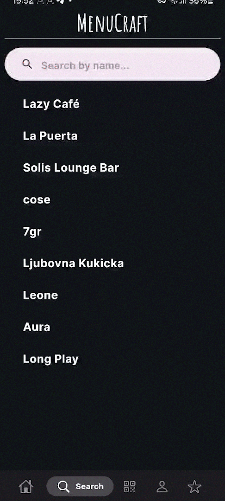
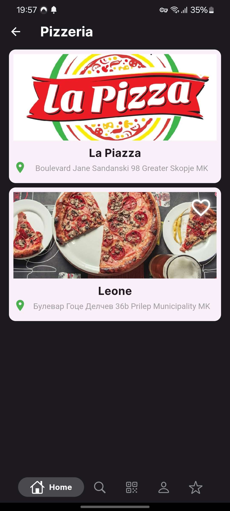
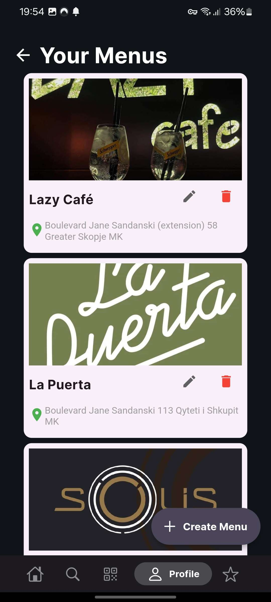

# MenuCraft 
Мобилна апликација за креирање и скенирање на дигитални менија за угостителски објекти.  
Изработено од:
- Маја Вуевска 203007
- Марија Савеска 201062
- Давид Арсовски 206003
### Функционалности
- Прикажување на менија на угостителски објекти
- Скенирање QR кодови на менија
- Креирање на дигитални менија
- Додавање омилени менија
- Пребарување менија
- Креирање кориснички профили
- Листање на сопствено креирани менија
### Имплементација
### Веб Сервиси
- Користење на Firebase
    - Автентикација
    - Чување на податоци во нерелациона база
    - Чување на слики генерирани од корисници
###   Custom UI елементи
- Appbar
- Форми за регистрација и најавување
- Картички за приказ на менија на ресторани
- Копчиња за додавање омилени менија
- Копчиња за промена на менија
- Копчиња за поставки на профилот
- Приказ и избор на локација на мени
- Приказ на профилна слика на корисник и мени
- Форма за пребарување на менија
- Изглед на QR скенер
- Филтрирање според категории на менија
- Приказ на детали на менија
- Форми за додавање на нови менија, категории и производи во менијата
- Форма за промена на корисничка лозинка
- Форма за промена на заборавена корисничка лозинка
###  Применети барем 3 шаблони за дизајн на софтвер
- Observer Pattern - користење на Provider архитектурата која што овозможува Flutter апликациите да имаат лесен пренос на состојба помеѓу различни widgets кои се наоѓаат на различни позиции во Widget Tree
- Singleton Pattern - креирање на една врска од базата на податоци и автентикациски сервиси од Firebase
- Factory Pattern - помош при креирање на објекти без откривање на логиката за креирање
### Да памти состојба
Во апликацијата постојат повеќе важни состојби кои постојано треба да бидат запаметени. Такви се состојбата за моменталниот најавен корисник, неговите омилени менија и најблиските ресторани.
###  Да користи сензори, камера или локациски сервиси. (најмалку 2 различни)
Во апликацијата користиме камера каде може корисникот да скенира QR код кој ќе го пренасочи до мени. Користиме локациски сервиси за приказ на ресторани кои се во близина на моменталната локација на корисникот и избор на локација при креирање на ново мени.
### Документација
Стартување на апликацијата: `flutter run`  
При прво вклучување на апликацијата сите можности на апликацијата се објаснети.  

## Слики и видеа

  

  

  
  

- Intro animation

- Adding Favorites

- Scanning QR Codes

- Searching Menus

- User Profiles

- QR Code Generation

- Categories

- Items

- Filtering

- Your Menus
